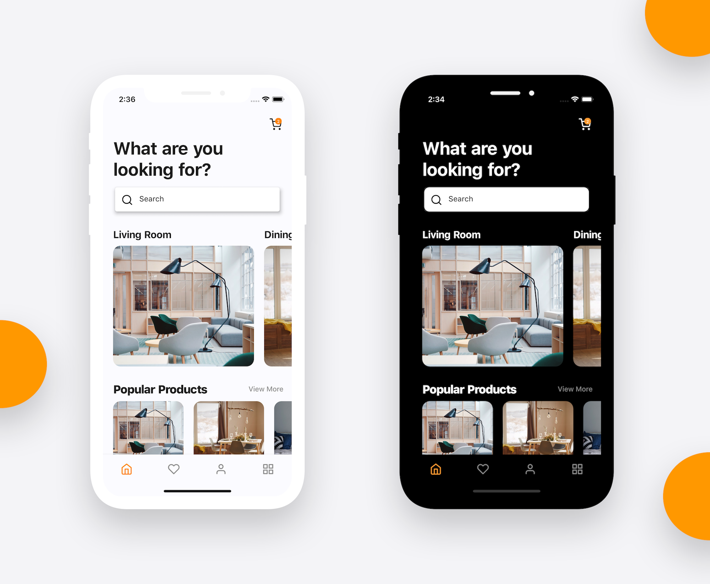
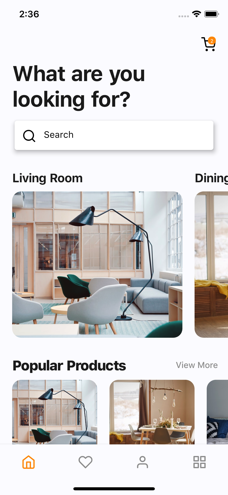
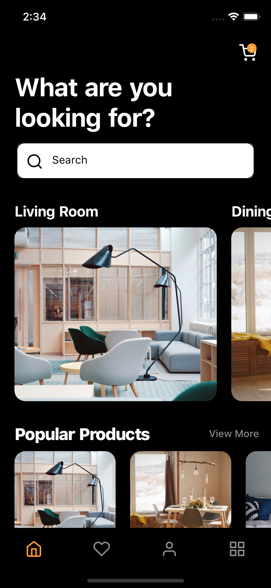
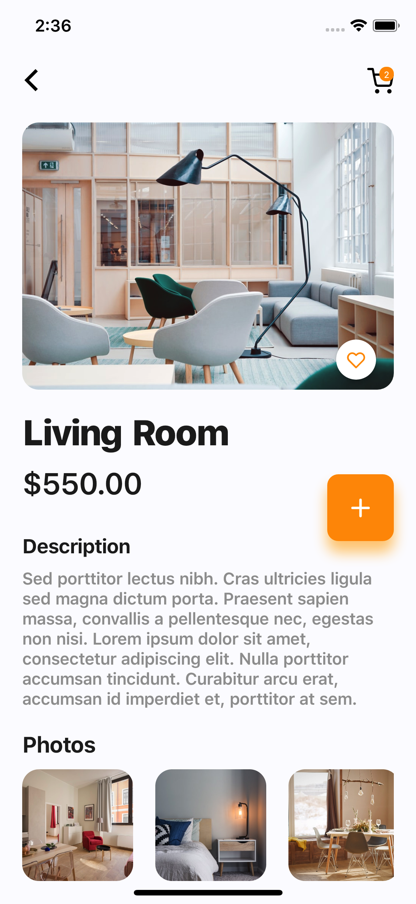
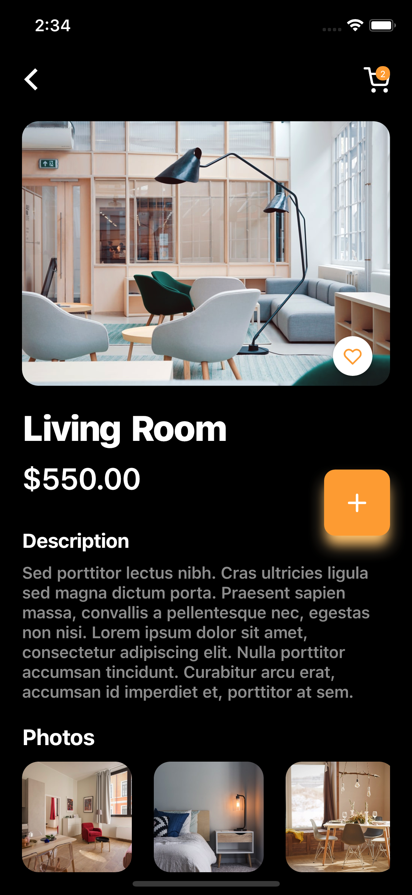

# 🛏🛏 Flutter Furniture App Concept 

Flutter representation of a Furniture App Concept We found for the project.

Star⭐ the repo if you like what you see😉.

Images are from [Unsplash](https://unsplash.com)

<a href="ss/app.apk"></img></a>

## ✨ Requirements
* Any Operating System (ie. MacOS X, Linux, Windows)
* Any IDE with Flutter SDK installed (ie. IntelliJ, Android Studio, VSCode etc)
* A little knowledge of Dart and Flutter
* A brain to think 🤓🤓

## 📸 ScreenShots

| Light| Dark|
|------|-------|
|||
|||

## 🌗 Toggle theme
To toggle the theme, change the `isDark` variable in `main.dart`.

`true` for dark and `false` for light.

## 🤓 Author(s)
**Sazzad Hossain & Aminul Haque Ashik** 

## 🔖 LICENCE
[GNU](https://www.gnu.org/licenses/gpl-3.0.en.html#content)
